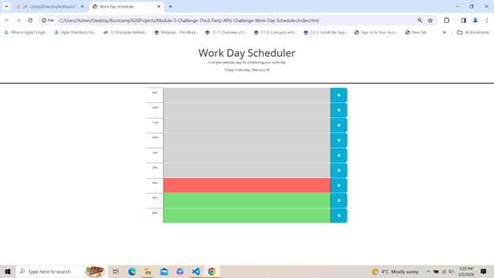

# Module-5-Challenge-Third-Party-APIs-Challenge-Work-Day-Scheduler

* Made changes to the exising code to prepare a workday scheduler to show time table from 9:00 AM to 5:00 PM.
* Any change in the task will update the task with new changes and when user reloads the page, previously saved tasks will show up.
* Past, present and future time slots have different colors which makes it easier for the user to know which task has already passed, which is due at present and what is due in future. 

## Technologies used
* HTML
* Advanced CSS
* jQuery

## Homepage visuals

## link to Github repository 
https://github.com/Rubal103/Module-5-Challenge-Third-Party-APIs-Challenge-Work-Day-Scheduler

## link to live website

https://rubal103.github.io/Module-5-Challenge-Third-Party-APIs-Challenge-Work-Day-Scheduler/
